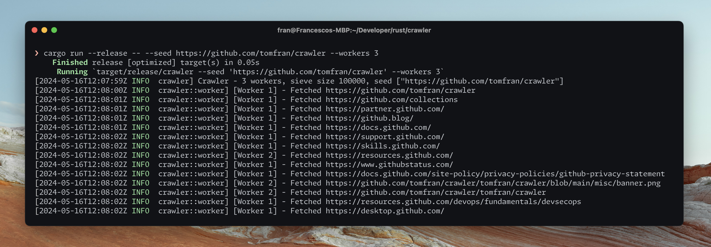

# Crawler
A web crawler written in Rust.

[](https://github.com/tomfran/crawler/actions/workflows/ci.yml)

**Table of Contents**
- [1. Architecture](#1-architecture)
  - [1.1 Worker](#11-worker)
  - [1.2 Dispatcher](#12-dispatcher)
- [2. Commands](#2-commands)
- [3. Next steps](#3-next-steps)

## 1. Architecture

This crawler is made by two main components, the **Workers** and a **Dispatcher**.

The idea is to have multiple workers fetching pages, each one of them parse the HTML content extracting URLs from it, adding them to the Dispatcher. 
The workers then request another url from the latter component, re-executing this fetch and add loop.

### 1.1 Worker

The worker is a simple component in charge of retrieving the webpage content from an url. 
The main task is to send an HTTP request to a given url, and parse the retrieved page.
The page is returned as a collection of links, raw content, and a digest computed via simhashing the raw content.

### 1.2 Dispatcher

The dispatcher is the core of the crawler, it is in charge of accepting and returing URLs 
to visit. It must ensure no websites are visited twice and that no domain 
is flooded with requests.

**Probabilistic visited set**

The Dispatcher is in charge of discarding already visited URLs, for this reason 
a **Bloom filter** is used. The filter is capped in size *N*, specified by the user. 
Once we surpass this threshold the filter performance degrades, discarding more and more urls 
as a consequence.

**Politeness queue**

When a URL passes the filter it is added to a **to-visit deque**, which is 
polled by a thread adding it to the **politeness priority queue** component.

The idea of this last component is to respect a website by not flooding it with 
requests. A node is made of **(base_url, next_visit_timestamp)** and the priority is 
given by the second parameter. If a worker finds a node with **next_visit_timestamp** in the future, it waits.
The priority queue contains base urls, there exists a support map 
storing all the pages to visit for a base url.

The complete workflow to visit a new url is then: 
- peek into the priority queue, if the node is not visitable, wait;
- pop the head of the queue, extract a base url from the urls map;
- enqueue the old head with a new timestamp computed as **old + politeness_delay**;
- return the retrieved url.

## 2. Commands 

You can start a new crawl session with the following command: 

```
❯ cargo run --release <num_workers> <bloom_size> <seed_url_1> <seed_url_2> ...
```
E.g.
```
❯ cargo run --release 10 1000000 http://www.your.cool.website.com/  
```

The seed urls are manually enqueued in the Dispatcher.

## 3. Next steps

- [ ] Save pages on disk
- [ ] Discard quasi-duplicated pages via simhashing

---

*This web crawler is provided as-is and without warranty. The user assumes all responsibility and liability for its usage, including but not limited to any legal implications or consequences. The author of this software shall not be held responsible for any damages or issues arising from its use.*